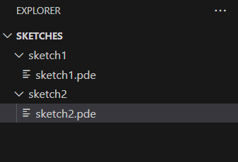
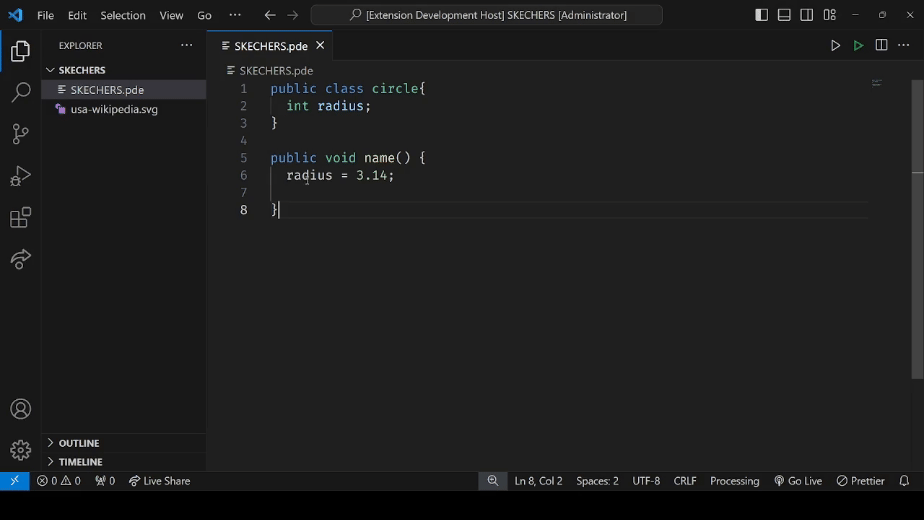
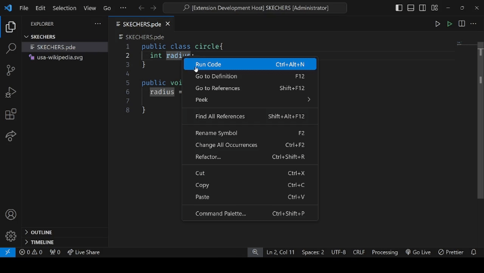
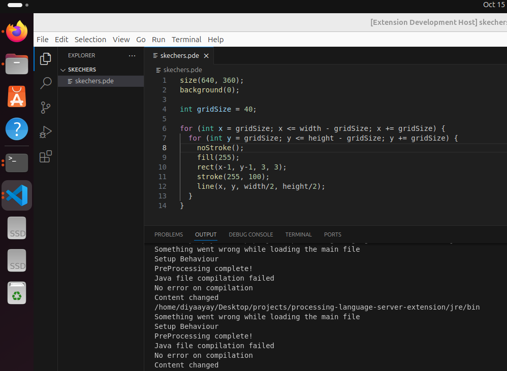

# Processing Language Server - VSCode Extension


<!-- <br /> -->
<!-- [](https://github.com/yourusername/ls4p/actions) -->

# Description

This project is an LSP extension that enables writing and running Processing sketches on Windows. It involves running Processing in headless mode along with a client-server JSON-RPC connection for LSP features. Both running sketches and LSP features have been tested on Windows, while LSP features have also been tested on Linux.

>[!NOTE]  
>The full feature set of this LSP extension is currently compatible only with **Windows**. For more information, go to the [Limitations](#limitations) section. 

## Run the extension in Windows 
- Download and install the dependencies:
	- Ensure `python >=3` is installed on your machine,
[here](https://www.python.org/ftp/python/3.13.0/python-3.13.0-amd64.exe).
	- [Download openJDK](https://github.com/alexkasko/openjdk-unofficial-builds#openjdk-unofficial-installers-for-windows-linux-and-mac-os-x), and make sure it is added to your system's environment variables.
- Download the Extension from [processing-language-server-extension](https://marketplace.visualstudio.com/items?itemName=DiyaSolanki.processing-language-server-extension)
- Create a sketch file within a sketch directory that shares the same name as the directory. You can create a sketchbook containing multiple sketch directories to run multiple sketches simultaneously.
- Click the run button in the top-right corner to execute a sketch.

## Tutorial


<!-- 
### SketchBook -->
<!--  -->


<!-- ## Capabilitites:

### On-Hover description


### Go-To-Definition


### Go-To-References


### Code-Completion


### Linux distribution
 -->

## Features
- On-Hover descriptions
- Syntax Highlighting
- Go-To-Definition
- Go-To-References
- Code Completion
- Running sketches
- Sketch error detection

## Installation

- [Node.js](https://nodejs.org/) (version 18 or higher)
- [npm](https://www.npmjs.com/)


## Build Instructions

```sh
git clone --branch Development https://github.com/diyaayay/processing-language-server-extension.git
cd processing-language-server-extension/
Run the script dependency.bat through any terminal (e.g., in Windows Powershell, run .\dependency.bat)
npm install
npm run watch
```

This project is currently under development. The default development branch is `Development`. To test, create a sketch directory. The sketch must exist in a directory with the same name as the sketch file itself (e.g., Sketch101/Sketch101.pde).

<br>

> [!NOTE]
> - If you run into any errors while installing, make sure you have `python >=3` installed on your machine,
[Download Python](https://www.python.org/ftp/python/3.13.0/python-3.13.0-amd64.exe).
> - If you run into any errors while installing, make sure you have `openJdk 7` installed for the node modules dependency 
`npm i java`. Refer to the following link to download it: [Download openJDK](https://github.com/alexkasko/openjdk-unofficial-builds#openjdk-unofficial-installers-for-windows-linux-and-mac-os-x), and it should be added to your system's environment variables.

## Limitations

- The LSP features work cross-platform, but sketch execution is currently limited to **Windows** due to the specific [symlink](https://doc.rust-lang.org/std/os/unix/fs/fn.symlink.html) setup for the Windows distribution.
- The large size of the extension is due to custom dependencies downloaded via the `dependency.bat` script. The [dependency.zip](https://github.com/diyaayay/processing-language-server-extension/releases/download/v1.2/dependency.zip) contains the Processing distribution for Windows, which is extracted into `jre/deps`.
- This limitation is due to the extension's JSON-RPC architecture, which enables client-server communication for IntelliSense features. A layered structure was established to connect the protocol, server, client, extension, and Processing distribution, using symlinks to package Processing and execute sketches from the sketch runner.
- Future development could use similar setups for other platforms to expand compatibility.

## Contributors

This Project was developed as a part of the 2024 New Beginnings (pr05) Grant from the [Processing Foundation](https://github.com/processing), aimed at creating a Language Server Protocol (LSP) extension for Processing sketches (.pde) and enabling sketch execution within VSCode. The project was mentored by [Sam Lavigne](https://github.com/antiboredom) and advised by [Justin Gitlin](https://github.com/cacheflowe).

It is based and inspired by a number of prior work:
- Luke Zhang's [Processing VSCode plugin](https://github.com/Luke-zhang-04/processing-vscode) forked from Avin Zarlez' earlier plugin.
- [Processing Language Server](https://github.com/kgtkr/processing-language-server-vscode) VSCode by kgtkr.
-  [Processing Language Server](https://github.com/Efratror/LS4P) (LS4P) by Efratror based on earlier work by Syam Sundar Kirubakaran.
- [LS4PDE](https://github.com/pr1metine/ls4pde) by Thanh aka pr1metine.

I would like to express my gratitude to the developers of the prior work, my mentors, and my fellow open-source contributor friends who have continuously supported and helped me along the way.